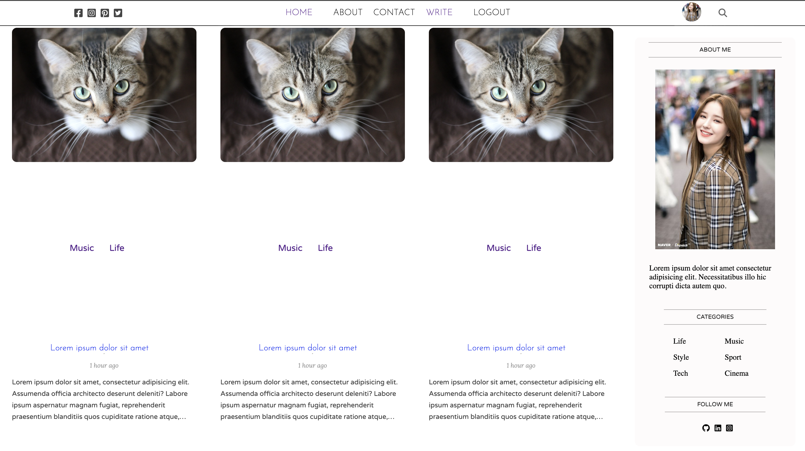

# MY MERN BLOG

```bash
This Project is on Development, will be conttinue update
```

## Descriptions

`My Mern Blog` was developed using [ReactJS](https://reactjs.org) for self learning and This project was Inspired by [savak](https://www.youtube.com/@LamaDev).

## Installation

To Install this Application :

- Clone  
  `git clone https://github.com/ivandi1980/my-mern-blog.git`
- Install
  ```bash
  yarn install
  ```

## Usage

To Start this Application, simply run

```bash
yarn start
```

## Screenshoot



## Credits

[ivandjoh](https://linkedin.com/in/ivandjoh)
[delvin](https://github.com/delvincakep)
